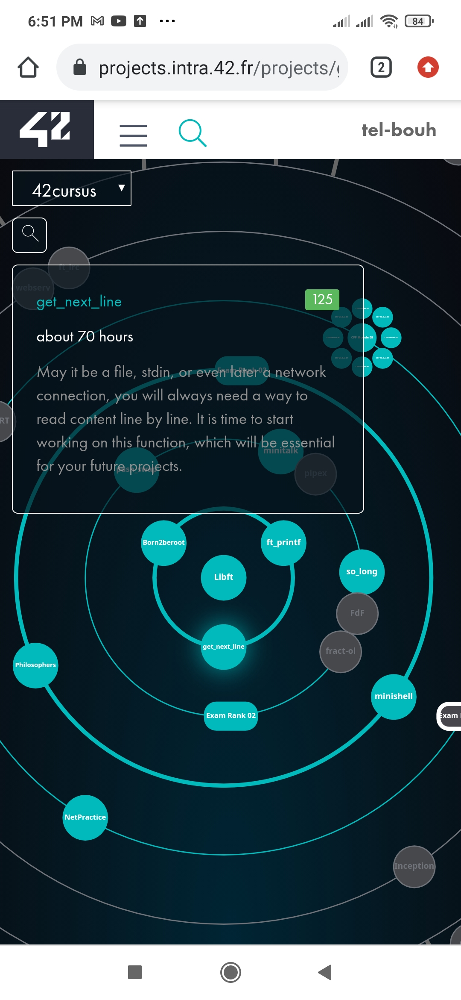

# Get_next_line: the second pjoject in 42 cursus.

The aim of this project is to make you code a function that returns a line, read from a file descriptor.

## Table of contents

- [GetNextLine](#42 cursus)
  - [Table of contents](#table-of-contents)
  - [Overview](#overview)
  - [The project](#the-project)
  - [Screenshot](#screenshot)

## Overview

The aim of this project is to read a entire file line by line.

### The project

- This project will not only allow you to add a very convenient function to your collection,
  but it will also allow you to learn a highly interesting new concept in C programming:
  static variables.

### Screenshot

